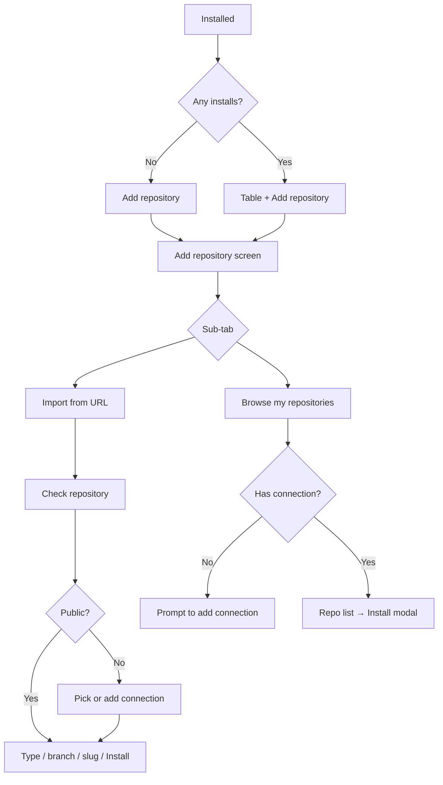

# Gitwire UX — Installed-first & Add repository flow

Product direction for moving away from a top-level Browse tab and a global “Connect first” gate. This doc is the UX source of truth for that work; implementation details live in code and separate technical notes.

> **▷ Review (Claude):** Inline blockquotes marked “Review (Claude)” are second-pass notes — agreements, dissents, and sharper edges. Sequenced build plan lives in [`ux-add-repository-plan.md`](ux-add-repository-plan.md). The short version: the direction here is right; my pushback is concentrated on (a) not overselling per-user connections as *security*, (b) dialing back the delete-protection modal on WP’s native screens, and (c) shipping this in three phases so a credentials data-model migration doesn’t block the UX wins.

---

## Goals

1. **Installed is home** — users manage what Gitwire installed, not “browse Git hosting.”
2. **No forced Connect** — public URL import and viewing installed items work without global credentials.
3. **Connections in context** — ask for auth when Browse or a private URL needs it.
4. **Pro differentiation** — multiple connections, per-user connections, delete protection (see [Free vs Pro (UX)](#free-vs-pro-ux)).

---

## Navigation

| Tab | Role |
|-----|------|
| **Installed** | Home — table, **Add repository**, optional Gitwire badges on WP lists |
| **Settings** | **Connections** (GitHub / GitLab / Bitbucket), Smart Install, cache, etc. |

**Removed:** top-level **Browse** tab.

Browse and Import remain as **sub-tabs inside Add repository**, not main nav.

Optional escape hatch: Settings link “Browse repositories…” opens Add repository on the Browse sub-tab.

> **▷ Review (Claude):** Agree with removing the tab. Two additions:
> - **Default the sub-tab by connection state** — no connection → open on *Import from URL* (works with zero setup); has a connection → open on *Browse*. Remember the last-used sub-tab. This kills the “Browse is now an extra click” regression for power users.
> - **Keep `?path=browse` alive.** `app.js` routes that query param and syncs the WP submenu ([app.js](../src/app.js)). When the tab is gone, redirect `?path=browse` to open the Add repository panel on Browse so old bookmarks/submenu links don’t dead-end.

---

## Empty & entry states

### Empty Installed (no Connect wall)

```text
No repositories yet

Install plugins and themes directly from GitHub, GitLab, or Bitbucket.

[ Add repository ]
```

Optional secondary line: “You can paste a public link without connecting an account.”

Use one label everywhere: **Add repository** (or **Install a repo** — pick one and stick to it).

> **▷ Review (Claude):** Pick **“Add repository.”** The screen does two things (browse *and* URL import); “Install a repo” presumes the URL path. The current full-area `ConnectPrompt` wall ([connect-prompt.js](../src/components/connect-prompt.js)) is the single worst thing for first-run now that public installs need no credentials — replacing it with this action-oriented state is the highest-value change in Phase 1.

### Installed with items, zero connections

Show the table. Updates may show per-row **Needs connection** — do not hide installed items.

### Header (non-empty Installed)

Primary button above the table: **Add repository** (same action as empty state).

---

## Add repository (panel or large modal)

**Title:** Add repository

**Sub-tabs:**

| Sub-tab | Purpose |
|---------|---------|
| **Browse my repositories** | Current Browse behavior (providers, search, detection, install) |
| **Import from URL** | Paste link → verify → install |

**Footer:** Cancel | Install (when ready)

> **▷ Review (Claude):** Make this a **full-width slide-over / route, not a small modal.** Add repository → Browse → install confirmation (and URL → check → connection picker → branch/slug) is a lot of nested state, and the existing `install-modal` already opens a modal — stacking another under it produces modal-in-modal. Resolve every sub-state inline in one wide surface.

### When no connection exists

| Sub-tab | Behavior |
|---------|----------|
| Browse | “Add a connection to see your repositories” + action → Settings or inline connect. **Do not** block opening Add repository. |
| Import from URL | URL field always enabled; public repos can proceed without a saved connection. |

---

## Import from URL — flow

### Layout

```text
[ Repository URL                                    ]
[ Check repository                          ]  (primary)
```

Use **Check repository** (not “Check connection”) — clearer for public repos; private flow still checks access.

Single spinner on the button; results inline below the URL (no navigation away).

> **▷ Review (Claude):** **Public vs private is ambiguous and the UI must own that.** An unauthenticated call returns 404 for *private OR typo OR deleted* — you often can’t distinguish them. So the result after Check can’t confidently say “this is private”; when the anonymous read fails, offer the connection picker *and* keep the “check the link” path open (the error table below already handles this — make the flow respect it rather than asserting “private”).

### After Check — public

```text
✓ Public repository
Type: Plugin | Theme | Unknown

[ If unknown ]
  - Smart Install on  → same rules as today (block / force type per settings)
  - Smart Install off → user selects Plugin or Theme

Directory / slug conflict → same warnings as current install modal
Branch → dropdown, default branch pre-selected

[ Install ]
```

### After Check — private

```text
This repository is private.

Use a connection:
  ( ) Personal — GitHub @you (default)
  ( ) Site — GitHub @agency
  ( ) Add new connection…

[ Connect & continue ]
```

After connection succeeds → same as public path (type, branch, slug, conflicts, Install).

### Error copy (plain language)

| Case | Message direction |
|------|-------------------|
| Invalid URL | “We couldn’t recognize this link. Use GitHub, GitLab, or Bitbucket.” |
| Not found / no access | “Repository not found or you don’t have access.” |
| Private, no connection | Show connection picker — not a generic API error |

---

## Browse my repositories (sub-tab)

Same list/cards and install UX as today’s Browse panel.

**Multiple connections (Pro):** filter at top, e.g. “Showing: Personal (default) ▾”, or one account at a time + switcher. Each installed repo should remember which connection was used for updates.

**Requires connection** per provider to show that provider’s repos; providers without credentials are omitted or show an inline “Connect GitHub” prompt.

---

## Connections (Settings)

Mental model: **Connections**, not “Connect your account first.”

| Provider | Notes |
|----------|--------|
| GitHub | PAT / token (not password) |
| GitLab | PAT; optional self-hosted URL |
| Bitbucket | Email + API token |

### Free

- One connection per provider (site-wide).
- Document that all admins with plugin install capability can use these credentials in Browse.

### Pro

- **Multiple connections** per provider with one **default** per provider.
- **Personal vs site:** label clearly — “Site (all admins)” vs “Personal (only you)”.
- Browse / Import pickers list only the current user’s personal connections plus site connections they’re allowed to use.
- Store `connection_id` (or equivalent) on each **installed** record so updates stay on the right account.

**Expectation:** per-user connections hide credentials and repo lists from other admins; installed files still exist on disk for anyone with `install_plugins` / `delete_plugins`. Set that expectation in help text.

> **▷ Review (Claude):** Make this caveat **loud, not buried** — it’s the difference between an honest feature and a broken promise:
> - **Per-user is organization, not security.** Any admin can run a code-snippet plugin and dump the options table (salts included). Sell it as “keep your accounts out of colleagues’ pickers,” never “private/secure from other admins.”
> - **Encrypt tokens at rest** (key from `wp_salt()`) regardless of free/pro. Tokens are plaintext in `gitwire_settings` today. Encryption won’t stop a determined admin but stops backups/DB dumps leaking *live* tokens — and lets the UI honestly say “encrypted.”
> - **Design the orphaned-connection state.** When the admin who added a personal connection leaves, repos installed with it can’t update. Needs a per-row “Needs connection — reconnect” state and a decision on who can re-own it.

---

## Gitwire badge (plugin & theme lists)

**Free:** light treatment — small “Gitwire” badge or icon next to the name; tooltip e.g. “Installed from `owner/repo` on GitHub”.

**Pro (optional enhancement):** link to Installed row or repo URL.

Keep badges subtle and consistent on Plugins and Themes screens.

---

## Delete protection (Pro)

**Rule (product language):** If user A installed a repo via Gitwire using a **personal** connection, user B should not delete it silently.

**UX:** On delete attempt → modal, not a silent block:

```text
This was installed through Gitwire from org/repo.
Installed by: {display name}

[ Open in Gitwire ]  [ Delete anyway ]  (only if capability allows)
```

- Same user: normal delete, or explicit “Remove from Gitwire” vs “Delete files” if we add both.
- Site-wide connection: treat as site asset; configurable which roles can delete (e.g. super admin only).

Always explain **why** delete is restricted and **who** installed it.

> **▷ Review (Claude):** **Dial back the native-screen modal — it’s the riskiest promise in this doc.** WP core’s delete is a bulk-action + JS confirm + POST; injecting a custom modal into it cleanly across WP versions is fragile and can feel like Gitwire is hijacking WP. Split it:
> - **Gitwire’s own Installed table** (we own the UI): full experience — “installed by X,” confirm modal, “Remove from Gitwire” vs “Delete files.”
> - **Native Plugins/Themes screen:** light only — badge/tooltip “Managed by Gitwire (installed by X)” plus a capability-gated `delete_plugin` server-side hook that blocks with a clear notice when policy says so. Don’t promise an injected modal there.
> - **Honesty:** files + `delete_plugins` cap exist regardless, so copy is “Gitwire warns / can restrict,” not “protects.”

---

## Free vs Pro (UX)

| UX | Free | Pro |
|----|------|-----|
| Add flow: Browse + Import URL | ✓ | ✓ |
| Public URL import (no connection) | ✓ | ✓ |
| Single connection per provider (site-wide) | ✓ | |
| Multiple connections + default per provider | | ✓ |
| Personal (per-user) connections | | ✓ |
| Badge on plugin/theme list | ✓ (light) | ✓ (+ link optional) |
| Delete guard / “installed by X” | | ✓ |

Commercial packaging (separate plugin vs license) is a business decision; this table is UX scope only.

---

## Decisions log

| Decision | Choice | Rationale |
|----------|--------|-----------|
| Remove Browse tab | Yes | Installed-first; Browse lives inside Add repository |
| Force Connect on empty app | No | Action-oriented empty state; contextual auth |
| Browse pattern | Keep inside Add | Same power, simpler nav |
| Import without connection | Public only in Free | Honest try-before-connect |
| Check button label | Check repository | Less confusing than “Check connection” |
| Two empty CTAs | One label globally | Avoid “Connect” vs “Install” split |

---

## Anti-patterns

1. Removing Browse **functionality** — only remove the **top-level tab**.
2. Blocking the whole admin until Settings has a token.
3. Delete protection with no explanation modal.
4. Storing or asking for raw passwords — tokens / app passwords only.
5. Different primary labels on empty state vs header (“Connect” vs “Add repository”).

---

## Related technical notes (out of scope for this doc)

- URL parser, `POST /repos/resolve`, layered auth (`global` → `per-repo` → anonymous public) — see implementation planning separately.
- `Provider_Factory` and `gitwire_installed` metadata for `connection_id` / `auth_mode`.
- Free plugin filters for Pro: `gitwire_provider_factory_auth`, `gitwire_can_install_repo`, `gitwire_installed_record`.

---

## Flow diagram


